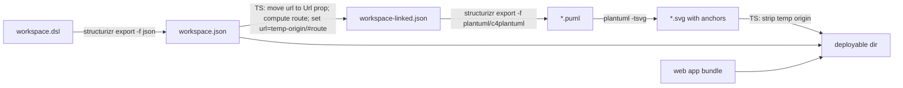

# Diagrams & Clickable Links

How diagram assets are produced and how elements become clickable in the web app. Related:
[summary.md](summary.md), [../terminology.md](../terminology.md).

## Mechanism (reference tool)

The reference tool does not post-process SVGs. It injects a per-element link into the PlantUML definition
_before_ rendering:

- It subclasses Structurizr's `C4PlantUMLExporter` / `StructurizrPlantUMLExporter` and overrides `writeElement`:
  set `element.url` to the drill-down route, call the parent writer, then restore `url`.
- The parent exporter emits the url as `$link="..."` (C4) or `[[...]]` (Structurizr). PlantUML renders a non-empty
  link as `<a href>` wrapping the element's shapes.
- `writeHeader` adds `skinparam svgDimensionStyle false` and `skinparam preserveAspectRatio meet`.
  `generatr.svglink.target` maps to `skinparam svgLinkTarget`.
- Element URLs defined in the model are moved to a property named `Url` at load, because the `url` field is reused
  for generated links.

## Our approach (TS orchestrator)

Do not subclass the exporter. Drive links through the workspace JSON's `url` field and let the Structurizr backend plus
PlantUML do the rendering. This reuses the existing exporter instead of reimplementing it.

**Current state: plain rendering only.** The CLI renders the workspace's **system landscape view** to
`<outputDir>/diagrams/<viewKey>.svg` and the web app shows it as a plain `` on the home page. Link injection and
origin stripping (the steps below) are **not implemented yet**. The exporter is hard-coded to `c4plantuml`; making it
configurable (`generatr.site.exporter`) comes later.

### Implemented slice

```mermaid
flowchart LR
    DSL[workspace.dsl] -->|structurizr export -f json| WJ[build/workspace.json]
    DSL -->|structurizr export -f plantuml/c4plantuml| PUML[temp/*.puml]
    WJ -->|read systemLandscapeViews[0].key| KEY[viewKey]
    KEY --> PUML
    PUML -->|plantuml -tsvg| SVG[temp/structurizr-viewKey.svg]
    SVG -->|write| OUT["build/diagrams/viewKey.svg"]
    WJ --> OUT
    WEB[web app bundle] --> OUT
```

Steps (`src/cli/pipeline/`):

1. `exportJson` → `outputDir/workspace.json` (also the web app's runtime data source).
2. `renderLandscape` reads `outputDir/workspace.json`, resolves the system landscape view key, and is a **no-op when the
   workspace has no landscape view**.
3. `exportPlantUml` runs `structurizr export -w <file> -f plantuml/c4plantuml -o <temp>`; Structurizr has no single-view
   export, so this writes `.puml` for every view into a temp dir. The `c4plantuml` exporter emits no `-key.puml` legend
   (the plain `plantuml` exporter does).
4. `runPlantUml` runs `plantuml -tsvg <temp>/structurizr-<viewKey>.puml`, which writes
   `structurizr-<viewKey>.svg` in place.
5. The SVG is moved to `outputDir/diagrams/<viewKey>.svg`; the temp dir is removed.

The web app addresses the asset by view key via `src/shared/diagrams.ts` (`diagramPath`, `systemLandscapeViewKey`), so
CLI and web naming cannot drift (see [routing.md](routing.md)). `PlantUML stays an external dependency`
(`plantuml` on `PATH`, overridable with `--plantuml`); see [distribution.md](distribution.md).

Plain SVGs contain **no** `<a>` anchors; nothing is injected or stripped. `generate` runs `assemble` (wipes the dir),
then `exportJson`, then `renderLandscape`.

### Full pipeline (design; link injection not yet built)

The remainder of the pipeline drives clickable drill-down links through the workspace JSON's `url` field, reusing the
existing exporter instead of reimplementing it. Not implemented yet.



Steps:

1. `structurizr export -w workspace.dsl -f json -o build` → `workspace.json` (also the web app's runtime data source).
2. TS builds a linked copy of the JSON. For every element: move any user-defined `url` into property `Url`; compute
   the drill-down route; set `url = <temp-origin>/#<route>`. `ModelItem.setUrl` rejects relative URLs, so the route
   is wrapped in a valid absolute URL and stripped later (the reference tool uses `TEMP_URI` for the same reason).
3. `structurizr export -w workspace-linked.json -f plantuml/c4plantuml` (or `plantuml/structurizr` per
   `generatr.site.exporter`) → `*.puml`.
4. `plantuml -tsvg` → `*.svg` containing `<a href="<temp-origin>/#<route>">`.
5. TS strips `<temp-origin>` from the SVGs.
6. Assemble the output directory (web app bundle + clean `workspace.json` + SVGs).

The runtime `workspace.json` stays clean: original element urls, no temp origin. `structurizr` is the backend command
resolved per [distribution.md](distribution.md).

## Drill-down rules (ported from the reference tool)

- Software system, included, and not the current view's system → `/<system>/container/`.
- Software system equal to the current view's system, and it has containers or image views → `/<system>/container/`;
  otherwise → `/<system>/context/`.
- Container with components or image views, in a view that is not a component view → `/<system>/component/<container>/`.
- Component with an image view → `/<system>/code/<container>/<component>/`.
- Otherwise → the element's own URL from property `Url`.
- A drill-down link takes precedence over the `Url` property.
- `normalize()`: lowercase, whitespace → `-`, strip `|\?*<":>+[]/'`, append `-` to Windows reserved names.
- Systems tagged `generatr.site.externalTag` get no drill-down link and are excluded from navigation.

## Routes

Hash-based (`#/...`). SVG anchors work unchanged with no static-host fallback or click interception. Decision **D4**.
See [routing.md](routing.md) for how the web app declares and resolves them.

## Invariants

- Routes derive from element names via `normalize()`; renaming an element changes its route.
- The `Url` property holds the user's original element URL; the `url` field carries generated drill-down links.
- Only included software systems receive links.

## Caveats

- **Pan/zoom vs click.** `svg-pan-zoom` swallows clicks; the reference tool disables links in its zoom modal. The web app
  must define the interaction model (click vs drag threshold). UX decision, not a technical blocker.
- **Version drift.** The reference pins `structurizr-core/export` 6.2.2; the tool uses whatever Structurizr backend is
  installed (vNext 2026.09.19 bundles libraries 6.2.3). Link behavior is identical; diagram styling may differ. Point
  `--structurizr` at a pinned war/Docker tag when reproducibility matters. See [distribution.md](distribution.md).
- **Property round-trip.** `generatr.*` properties live in `views.configuration.properties`; confirm they survive the
  JSON export before relying on them.
- **Image/code view rules** depend on `imageViews` / `componentViews` being present in the JSON.
