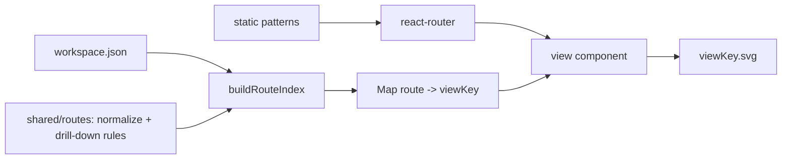

# Routing

How the SPA's hash routes are defined and resolved. Related: [summary.md](summary.md), [diagrams.md](diagrams.md),
[repository-layout.md](repository-layout.md).

## Decision

Hash-based routes (decision **D4** in [summary.md](summary.md)). Route **patterns** are static and declared in code;
the model→URL mapping is **derived from `workspace.json`** at load. There is no `routes.json`.

## Two meanings of "route"

- **Pattern** — the URL shape. Fixed, independent of the model, declared once.
- **Instance** — a concrete URL for a system/container/component. A pure function of the model and views.

## Patterns

| Pattern | View |
|---|---|
| `#/` | home |
| `#/:system/context` | system context view |
| `#/:system/container` | container view |
| `#/:system/component/:container` | component view |
| `#/:system/code/:container/:component` | code/image view |

The router matches these. It is never handed a list of routes.

## Deriving the route index

`buildRouteIndex(workspace)` walks the model and views, applies the same `normalize()` and drill-down rules the CLI
uses for link injection, and returns `Map<route, viewKey>`. Each view component parses its params, resolves the view
key through the index, and loads the matching diagram asset.

## Why no routes.json

- Redundant: the SPA already fetches `workspace.json`, from which the index is a cheap pure computation.
- Drift risk: two artifacts that must agree are a bug source; one shared module makes divergence impossible.
- The only real coupling is the route formula, and that already lives in `src/shared/routes`.

## Diagram asset addressing

The CLI's `assembly` step names each rendered diagram `<viewKey>.svg`. The SPA addresses assets by view key, which is
already present in `workspace.json`. No sidecar mapping is needed.

## Framework

**react-router v7 `createHashRouter`.** Patterns are static, params resolve against model data at runtime, and hash
history is built in. TanStack Router was considered and rejected: its generated, type-safe route tree buys little when
every param is validated against the model anyway. Revisit only if typed loaders and search-param validation become
needs.

## Invariant

For any element, the drill-down route the CLI injects into the SVG equals the route the SPA resolves for that element.
Both sides call the same `normalize()` and drill-down rules in `src/shared/routes`.

## Related

- Drill-down rules and link injection: [diagrams.md](diagrams.md).
- Hash-route decision **D4**: [summary.md](summary.md).
