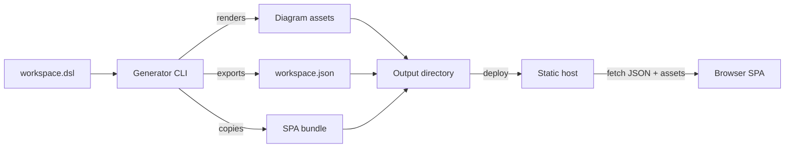

# Architecture

> **Status: top-level shape defined; component details still open.** The owner has fixed the build/runtime split (see
> Decisions). Split into focused files (e.g. `pipeline.md`, `renderer.md`, `spa.md`, `cli.md`) as the design grows.

## Shape

The generator is a CLI that produces a **deployable static directory**. There is no server and no per-element
generated HTML. Instead:

- The CLI exports the workspace as **Structurizr JSON**.
- The CLI renders each view to a static **diagram asset**.
- The CLI assembles a prebuilt **SPA** into the output directory.
- The SPA runs in the browser, fetches the JSON and diagrams, and renders the whole site client-side.

The output directory is self-contained and deployable to any static host (NGINX, GitHub Pages, object storage).

## Decisions

- **D1 — Client-rendered site.** The site is an SPA, not generated HTML. The workspace is consumed as exported
  Structurizr JSON at runtime, not baked into pages at build time.
- **D2 — CLI produces a deployable directory.** `generate-site` renders diagrams, exports JSON, and assembles the SPA
  plus diagrams plus JSON into one directory ready for a static host.
- **D3 — Hosting is static and external.** NGINX / GitHub Pages / similar. No application server.
- **D4 — Hash-based routes.** Drill-down links and SPA navigation use hash routes (`#/...`), so SVG anchors work
  without static-host fallback or click interception. See [diagrams.md](diagrams.md).
- **D5 — Structurizr is an external runtime dependency, not vendored.** The legacy `structurizr-cli` is archived;
  vendoring would freeze the DSL parser. The maintained vNext tooling is invoked as an external command so new DSL
  features arrive by updating Structurizr. See [distribution.md](distribution.md).
- **D6 — Distributed as a self-contained binary.** The CLI and the embedded SPA are compiled with Bun into standalone
  executables for macOS and Linux, so users need no Node. Node is a build/test tool only. See
  [distribution.md](distribution.md).
- **D7 — One package, one binary.** The CLI, the SPA, and the shared code are source trees inside a single package; no
  workspaces. The SPA is embedded in the binary and has no independent consumer, so a separate package would only force
  a lockstep version pin. See [repository-layout.md](repository-layout.md).
- **D8 — Routes are static patterns plus a model-derived index.** Route patterns are declared in code; the model→URL
  mapping is derived from `workspace.json` at load. No `routes.json`. See [routing.md](routing.md).
- **D9 — `serve` is a static preview server.** `serve` runs `generate-site` and then serves the output directory over a
  dependency-free HTTP server (Node's `node:http`, which Bun provides in the compiled binary; default port 8080).
  Unknown extensionless paths fall back to `index.html`; requests are confined to the output directory. Watch + live
  rebuild are deferred.

## Known constraints

- Consumes a Structurizr DSL workspace (optionally a Git repository with multiple branches).
- Exposes two commands: `generate-site` emits the deployable directory; `serve` generates and serves it over HTTP
  (port 8080 by default). Watch + live rebuild are not implemented yet.
- Behavior matches the reference tool unless the owner decides otherwise. The reference tool's output behavior
  (navigation, documentation, ADRs) is now the SPA's responsibility. See [../terminology.md](../terminology.md).

## Open questions (awaiting owner)

1. Language/runtime for the CLI and the SPA framework. **Resolved:** TypeScript CLI; React + Vite + react-router v7
   SPA. See [repository-layout.md](repository-layout.md) and [routing.md](routing.md).
2. Diagram asset format and renderer (reuse the PlantUML exporter? SVG? PNG?). **Partially resolved:** SVG rendered via
   PlantUML, with clickable drill-down links driven through the workspace JSON. See [diagrams.md](diagrams.md).
3. How documentation and ADRs are represented (markdown rendered by the SPA? pre-rendered?).
4. Whether anything is pre-rendered for SEO / no-JS.
5. CLI distribution and where the prebuilt SPA bundle lives. **Resolved:** Structurizr is an external runtime
   dependency; the CLI and SPA ship as self-contained Bun binaries. See [distribution.md](distribution.md).
6. How `generatr.*` properties map into the new design.

## Decisions log

- **D1–D3** — captured 2026-10-03 from owner direction: SPA reads Structurizr JSON from a static host; CLI emits a
  deployable directory (diagrams + JSON + SPA).
- **D4** — captured 2026-10-03: hash-based routes for SPA navigation and SVG drill-down links.
- **D5–D6** — captured 2026-10-03: Structurizr is an external runtime dependency (not vendored) so new DSL features
  track upstream; the CLI and SPA ship as self-contained Bun binaries (Node is a build/test tool only). See
  [distribution.md](distribution.md).
- **D7–D8** — captured 2026-10-03: single package (no workspaces); static route patterns with a
  model-derived index and no `routes.json`. See [repository-layout.md](repository-layout.md) and
  [routing.md](routing.md).
- **D9** — captured 2026-10-03: `serve` is a static preview server (generate + serve, port 8080, no watch/rebuild yet).
- vNext pipeline verified 2026-10-03 against `structurizr` 2026.09.19 / libraries 6.2.3; see
  [distribution.md](distribution.md).
- Diagram link mechanism and TS pipeline verified 2026-10-03; see [diagrams.md](diagrams.md).
