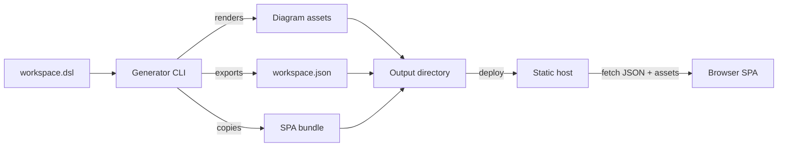

# Architecture

> **Status: top-level shape defined; component details still open.** The owner has fixed the build/runtime split (see
> Decisions). Split into focused files (e.g. `pipeline.md`, `renderer.md`, `spa.md`, `cli.md`) as the design grows.

## Shape

The generator is a CLI that produces a **deployable static directory**. There is no server and no per-element
generated HTML. Instead:

- The CLI exports the workspace as **Structurizr JSON**.
- The CLI renders each view to a static **diagram asset**.
- The CLI assembles a prebuilt **SPA** into the output directory.
- The SPA runs in the browser, fetches the JSON and diagrams, and renders the whole site client-side.

The output directory is self-contained and deployable to any static host (NGINX, GitHub Pages, object storage).

## Decisions

- **D1 — Client-rendered site.** The site is an SPA, not generated HTML. The workspace is consumed as exported
  Structurizr JSON at runtime, not baked into pages at build time.
- **D2 — CLI produces a deployable directory.** `generate-site` renders diagrams, exports JSON, and assembles the SPA
  plus diagrams plus JSON into one directory ready for a static host.
- **D3 — Hosting is static and external.** NGINX / GitHub Pages / similar. No application server.

## Known constraints

- Consumes a Structurizr DSL workspace (optionally a Git repository with multiple branches).
- Must support `generate-site` and `serve` (watch + live rebuild) modes.
- Behavior matches the reference tool unless the owner decides otherwise. The reference tool's output behavior
  (navigation, documentation, ADRs) is now the SPA's responsibility. See [../terminology.md](../terminology.md).

## Open questions (awaiting owner)

1. Language/runtime for the CLI and the SPA framework.
2. Diagram asset format and renderer (reuse the PlantUML exporter? SVG? PNG?).
3. How documentation and ADRs are represented (markdown rendered by the SPA? pre-rendered?).
4. Whether anything is pre-rendered for SEO / no-JS.
5. CLI distribution and where the prebuilt SPA bundle lives.
6. How `generatr.*` properties map into the new design.

## Decisions log

- **D1–D3** — captured 2026-10-03 from owner direction: SPA reads Structurizr JSON from a static host; CLI emits a
  deployable directory (diagrams + JSON + SPA).
