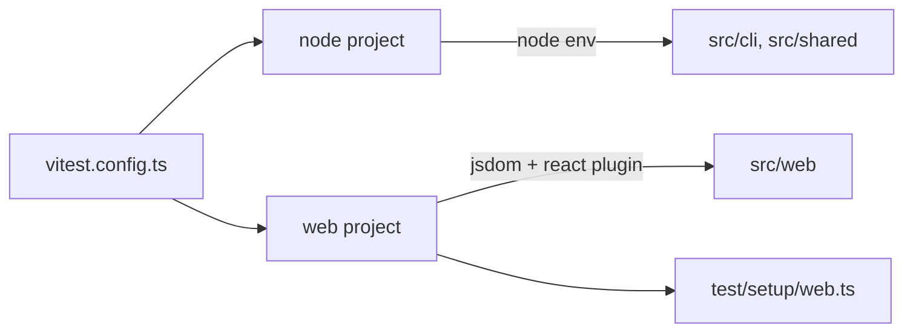

# Testing

How the project is unit tested. Related: [repository-layout.md](repository-layout.md),
[distribution.md](distribution.md), [../practices.md](../practices.md).

## Decision

- **Vitest is the only unit-test runner.** One config (`vitest.config.ts`) drives both the Node CLI/shared code and the
  React web app. It is separate from `vite.config.ts` so the web app build root (`src/web`) does not leak into test discovery.
- **React Testing Library** drives DOM assertions for React components. Tests query by role/text, not by implementation.
- **Two Vitest projects** split by runtime:
  - `node` — `environment: "node"`, covers `src/cli/**`, `src/shared/**`, `test/e2e/**`, and `dev/**`.
  - `web` — `environment: "jsdom"`, React plugin enabled, covers `src/web/**`.
- **Unit tests are colocated** with the module under test: `<module>.test.ts` / `.test.tsx`. Shared fixtures and e2e
  live under `test/` (see [repository-layout.md](repository-layout.md)).
- **E2E tests live under `test/e2e/`** and are part of the `node` Vitest project. They exercise the real Structurizr
  backend and are `describe.skipIf`-gated on its presence, so the suite stays hermetic where it is absent (CI verify).
- **No globals.** Tests import `describe`/`it`/`expect`/`vi` from `vitest` explicitly.



## Config

```ts
// vitest.config.ts
export default defineConfig({
  test: {
    projects: [
      {
        test: {
          name: "node",
          environment: "node",
          include: [
            "src/cli/**/*.test.ts",
            "src/shared/**/*.test.ts",
            "test/e2e/**/*.test.ts",
            "dev/**/*.test.ts",
          ],
        },
      },
      {
        plugins: [react()],
        test: {
          name: "web",
          environment: "jsdom",
          include: ["src/web/**/*.test.ts", "src/web/**/*.test.tsx"],
          setupFiles: ["./test/setup/web.ts"],
        },
      },
    ],
    coverage: {
      provider: "v8",
      include: ["src/**/*.{ts,tsx}"],
      exclude: ["src/**/*.test.{ts,tsx}", "src/web/vite-env.d.ts"],
    },
  },
});
```

`test/setup/web.ts` loads the `@testing-library/jest-dom/vitest` matchers and calls RTL `cleanup()` after each test.

## TypeScript wiring

Test files must not enter the build output, so they are excluded from the build projects and checked by their own
project:

- `tsconfig.cli.json` / `tsconfig.web.json` `exclude` `**/*.test.ts(x)`, so `tsc` never emits test JS into `dist/`.
- `tsconfig.test.json` (referenced from the root solution file) type-checks `src/**/*.test.ts(x)` and `test/**/*.ts`
  with `noEmit`, DOM libs, and `types: ["node", "vite/client"]`.
- `tsconfig.node.json` also covers `vitest.config.ts`.
- `npm run typecheck` runs all four projects.

## Conventions

- **Mock at module boundaries** with `vi.mock` plus `vi.hoisted` for the mock value, e.g. `run` in `main.test.ts`
  mocks `./commands/generate-site.js`; `generate-site.test.ts` mocks `../assembly/assemble.js`.
- **Inject IO seams instead of mocking `node:fs`.** `assemble(outputDir, sourceDir)` takes the source bundle as an
  optional parameter (default `spaBundleDir`); the test copies real temp directories with `mkdtemp`.
- **Do not test constants tautologically.** Shared constants in `src/shared/site.ts` are covered through behavior:
  `App.test.tsx` asserts the rendered `SITE_NAME`, `generate-site.test.ts` asserts the resolved `DEFAULT_OUTPUT_DIR`.
  Generated code (`src/shared/workspace/schema.d.ts`) has no test; it is type-only and exercised by compilation.
- **Entrypoints with top-level side effects** (`bin.ts`, `web/main.tsx`) are tested with `vi.resetModules()` plus a
  dynamic `await import(...)` per test.

## Commands

| Command                 | Purpose                                                 |
| ----------------------- | ------------------------------------------------------- |
| `npm test`              | Run the suite once (`vitest run`).                      |
| `npm run test:watch`    | Watch mode.                                             |
| `npm run test:coverage` | Run with v8 coverage; writes `coverage/` (git-ignored). |

## Coverage

v8 coverage is reported with `npm run test:coverage`. There is **no enforced threshold and 100% is not a goal**: the
standard is that all important functionality is tested, not that every branch is exercised. Do not add tests for
far-fetched edge cases just to move the number. The `src/web/vite-env.d.ts` declaration is excluded, as are vendored
shadcn/ui components (`src/web/components/ui/**`) and generated hooks (`src/web/hooks/**`) — see [ui.md](ui.md).

## CI gate

Both `.github/workflows/ci.yml` and `.github/workflows/release.yml` run `npm run typecheck` and `npm test` alongside
`format:check` and `lint`. A failing test blocks merge and release. See [distribution.md](distribution.md).
