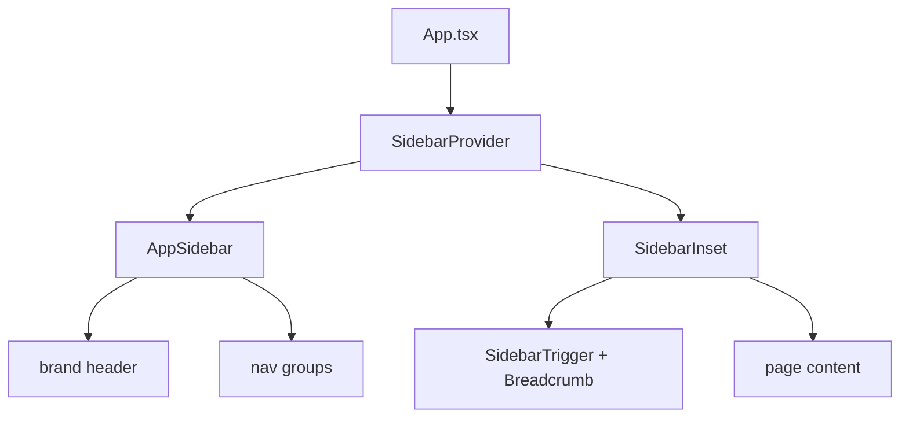

# UI

How the web app's visual layer is built. Related: [summary.md](summary.md), [repository-layout.md](repository-layout.md),
[routing.md](routing.md), [testing.md](testing.md).

## Decision

- **D10 — shadcn/ui components on Base UI, styled with Tailwind CSS v4.** The UI is assembled from vendored
  shadcn/ui components under `src/web/components/ui/`, built on `@base-ui/react` primitives with Tailwind utility
  classes. shadcn is not a runtime dependency: component source is copied into the repo and owned here.
- **D11 — Vendored UI is exempt from the lint and coverage gates.** Generated components export non-component values
  (`buttonVariants`, `useSidebar`) and use browser-only hooks (`useIsMobile`), so they are excluded from
  `react/only-export-components` / `react/set-state-in-effect` and from coverage. Our own layout code is not exempt.

## Stack

| Concern    | Choice                                                                 |
| ---------- | ---------------------------------------------------------------------- |
| Styling    | Tailwind CSS v4 (`tailwindcss`, `@tailwindcss/vite`), CSS-first config |
| Components | shadcn/ui, `base-nova` preset (`components.json`)                      |
| Primitives | Base UI (`@base-ui/react`)                                             |
| Class util | `cn` package, re-exported from `src/web/lib/utils.ts`                  |
| Icons      | `lucide-react`                                                         |
| Font       | Geist Variable (`@fontsource-variable/geist`)                          |
| Animation  | `tw-animate-css`                                                       |

All of these are build-time only (`devDependencies`); the emitted web app bundle is self-contained.

## Alias and layout

`components.json` maps shadcn's aliases onto the web app tree through the `@` alias, which resolves to `src/web`
(Vite/Vitest `resolve.alias`, plus `paths` in `tsconfig.web.json`, `tsconfig.test.json`, `tsconfig.node.json`, and
the root solution `tsconfig.json`):

```json
{
  "aliases": {
    "components": "@/components",
    "ui": "@/components/ui",
    "lib": "@/lib",
    "hooks": "@/hooks",
    "utils": "@/lib/utils"
  }
}
```

**Two aliases.** `@` → `src/web` (shadcn's tree) and `@shared` → `src/shared` (the runtime-agnostic contracts). Both
are declared in `vite.config.ts` and `vitest.config.ts` (`resolve.alias`) and in the `paths` of every tsconfig whose
files can reach them: `tsconfig.web.json`, `tsconfig.test.json`, `tsconfig.node.json` (the dev plugin imports web
code), and the root solution `tsconfig.json` (IDE). `src/web` imports are alias-based, not relative.

One sharp edge: `@shared/workspace` is a _directory_ import, and tsc's `paths` substitution does not fall through to
`index.ts` the way a relative specifier does, so each config also carries an explicit
`"@shared/workspace": ["./src/shared/workspace/index.ts"]` entry. Any future `@shared/<dir>` mapping needs the same
treatment.

```
src/web/
├── app/                 # App shell: SidebarProvider + SidebarInset
├── components/
│   ├── app-sidebar.tsx  # site navigation (sidebar-01 shell)
│   └── ui/              # vendored shadcn primitives (gate-exempt)
├── hooks/               # use-mobile.ts (gate-exempt)
├── lib/utils.ts         # cn re-export
└── styles/global.css    # Tailwind entry + shadcn theme tokens
```

## Shell

The `sidebar-01` block supplies the app shell: a collapsible sidebar (brand header, grouped navigation, rail) and an
inset content area (trigger, separator, breadcrumb). `App.tsx` composes it and takes the loaded workspace; the site name
(when present) flows into the sidebar header and headings. `app-sidebar.tsx` holds the navigation, currently placeholder
links that the model-derived route index will replace (see [routing.md](routing.md) and
[workspace-loading.md](workspace-loading.md)).



`main.tsx` loads the workspace before rendering and passes it (or `undefined`) to `App`; the site name derives from it via
`siteName()` in `src/shared/site.ts`. See [workspace-loading.md](workspace-loading.md).

## Theming

Theme tokens live in `src/web/styles/global.css` (`:root` and `.dark`, oklch values) and are exposed to Tailwind via
`@theme inline`. Dark mode is class-based (`@custom-variant dark (&:is(.dark *))`); nothing toggles `.dark` yet.

## Gates

- **Lint** (`.oxlintrc.json`): an `overrides` entry turns off `react/only-export-components` and
  `react/set-state-in-effect` for `src/web/components/ui/**` and `src/web/hooks/**`.
- **Coverage** (`vitest.config.ts`): the same two paths are excluded; layout components (`app/`,
  `components/app-sidebar.tsx`) stay covered by `App.test.tsx`.

## Invariants

- `src/shared/` stays runtime-agnostic; UI code lives under `src/web`.
- `src/web/components/ui/` is vendored and edited in place; re-add or refresh with `npx shadcn@latest add <name>`.
- Adding a shadcn component must not reintroduce a runtime `dependencies` entry; all UI packages are build-time.
