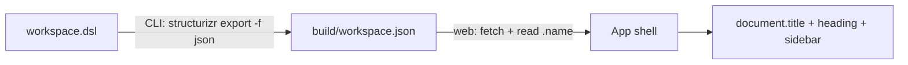

# Workspace Loading

How the workspace travels from the DSL file to the web app, and how the site name derives from it. Related:
[summary.md](summary.md), [workspace-types.md](workspace-types.md), [diagrams.md](diagrams.md),
[repository-layout.md](repository-layout.md).

## Slice

The first vertical slice is deliberately thin: **the site name comes from the workspace name**.

## Pipeline

`generate-site` with `-w/--workspace-file`:

1. `assemble(outputDir)` copies the prebuilt web app into the output directory.
2. `exportJson({ workspaceFile, outputDir, structurizr })` runs `structurizr export -w <file> -f json -o <outputDir>`,
   which writes `workspace.json`.

Export runs **after** assemble because Structurizr's JSON export preserves existing files in the output directory;
`assemble` itself wipes the directory first. Without `-w`, `generate-site` emits the web app only.

`serve` forwards `-w` and `--structurizr` to `generate-site`.

## Backend resolution

`src/cli/backend/`:

- `resolve.ts` — `--structurizr <command>` override, otherwise `structurizr` on `PATH` (`DEFAULT_STRUCTURIZR_COMMAND`).
  The full resolution order (war/Docker/environment) from [distribution.md](distribution.md) is **deferred**.
- `run.ts` — `runStructurizr(args, { override }, spawnFn)`; `defaultSpawn` captures stdout/stderr, rejects with the
  backend's output on a non-zero exit, and with an actionable message on `ENOENT` ("not found; install it, or pass
  `--structurizr <command>`"). `spawnFn` is the injectable IO seam.

`src/cli/pipeline/export-json.ts` is the first pipeline step (see [diagrams.md](diagrams.md) for the rest).

## Web loading

`src/web/data/workspace.ts` — `loadWorkspace(fetchFn = fetch)` fetches the deployment-relative `workspace.json`, and
returns `undefined` on a non-OK response or a thrown fetch, so a site built without `-w` still renders.

`src/web/main.tsx` awaits `loadWorkspace()` **before** `createRoot().render()`, sets `document.title` from `siteName()`,
and passes the workspace to `<App>`. Loading before render (rather than in an effect) keeps it free of
set-state-in-effect and gives a correct title on first paint.

`src/shared/site.ts` — `siteName(workspace)` returns `workspace.name` trimmed, or `SITE_NAME` ("Structurizr Site") when
the workspace is absent or unnamed. `Workspace.name` is optional in the schema, so the fallback is required regardless.

## Dev server

`npm run watch` runs Vite against `src/web` with HMR, but the app under dev has no `workspace.json` unless one is
served. `dev/dev-workspace.ts` is a dev-only Vite plugin (`apply: "serve"`) that fills that gap: it serves the workspace
export at `/workspace.json` by running the same `exportJson` pipeline the CLI uses, into a temp directory.

- **Lazy export.** The export runs on the first request, not at server start, so a backend failure surfaces as a `500`
  with the backend's message in the browser instead of preventing Vite from starting. The JSON is cached; a change to the
  workspace file invalidates the cache and re-exports on the next request.
- **Config.** `VITE_WORKSPACE_FILE` (default `test/fixtures/workspace.dsl`) selects the workspace; `VITE_STRUCTURIZR`
  overrides the backend command.
- **Cleanup.** The temp export directory is removed when the dev server closes (`httpServer` `close`).
- `dev/` is dev tooling, not shipped code: it is type-checked by `tsconfig.node.json` and unit-tested in the `node`
  Vitest project. `vite build` is unaffected (`apply: "serve"`; no `workspace.json` is emitted into `dist/web`).

## Invariants

- `build/workspace.json` is always named exactly `workspace.json`; the Structurizr JSON export does not vary the name
  with the workspace name.
- The web app fetches a **relative** path, so the site works under any static-host base path.
- The site name is a pure function of the loaded workspace; the placeholder is only a fallback, never a default that
  overrides a present name.
- The CLI never parses the DSL itself; Structurizr is the parser (decision **D5**).

## Witness

- `test/e2e/export-json.e2e.test.ts` — real backend, DSL → `workspace.json`, asserts `name === "My Architecture"`.
  Skipped when `structurizr` is not on `PATH`, so CI's verify job stays hermetic.
- `test/fixtures/workspace.dsl` — the named sample workspace.
